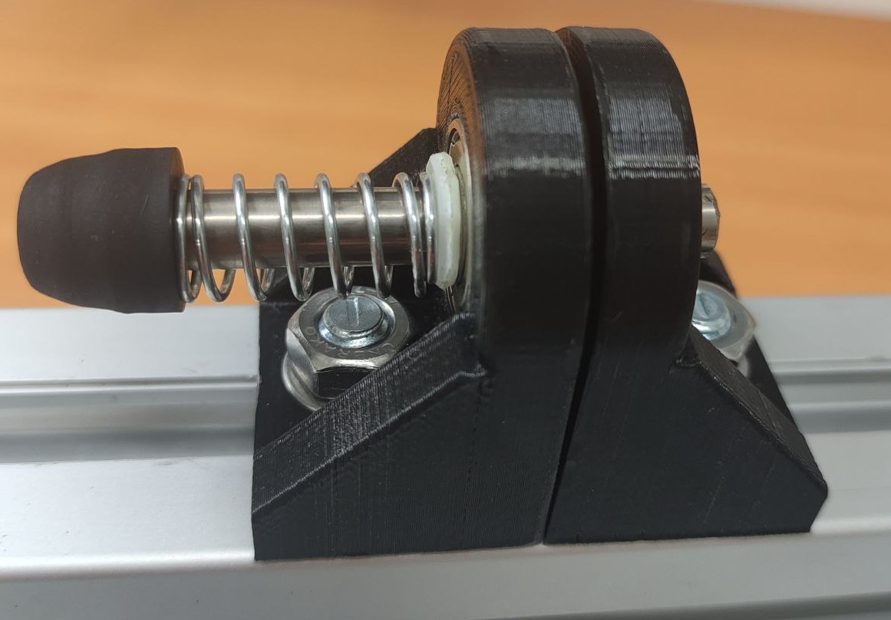
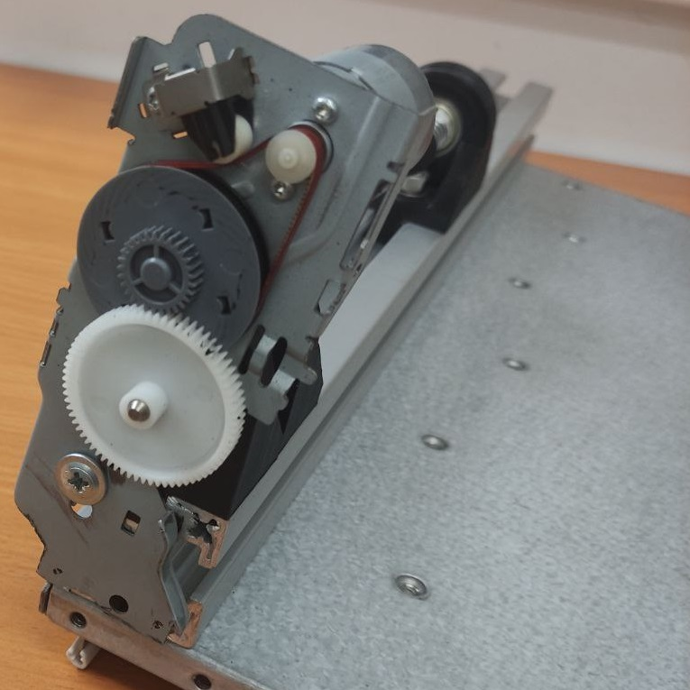

# OLTA-PCB-ROLL-CUTTER

 

Станок предназначен для точного резания рулонов пленочного фоторезиста. Также может использоваться для других маетриалов в рулонах.  
Состроит из непостредственно самого станка и резака.

 

 

3D-модели элементов находятся в папке 3d данного репозитория. Резак (3d\cutter). Станок (3d\machine). Все детали печатал PETG с 25% заполнением (опоры резака, думаю, лучше заполнить на 100%).
  
Резак состоит из:
1. Платформа (можно сделать из фанеры 16 мм).
2. Две опоры (печатаются на 3d-принтере).
3. Два продшипника ZZ608 (8x22x7).
4. Ось в виде болта, шайбы, гайки.
5. Два прижима лезвий (печатаются на 3d-принтере).
6. Два лезвия для роторного ножа 45 мм (покупал на Aliexpress).
7. Тюрючек, длина которого отвечает за ширину получающихся рулонов (печатается на 3d-принтере).
  
Станок состоит из:
1. Станина состоящая из пластины и конструкционного профиля 40х40.
2. Четыре опоры, образующие попарно заднюю и переднюю бабку (печатаются на 3d-принтере).
3. Четыре Т-болта, гайки, шайбы М8 для крепления опор к профилю.
4. Четыре продшипника ZZ608 (8x22x7).
5. Куски вала 8 мм взятые от струйного принтера.
6. Пружина задней бабки (взята с какого-то принтера).
7. Резиновые конусы для захвата рулона (берем с того же вала струйного принтера резиновые цилиндры, одеваем на приводной вал поочередно, включаем и болгаркой придаем форму конуса)
8. Привод передней бабки взят в сборе от того-же струного принтера и крепится в данной реализации на единственном саморезе к профилю.

3d- модель резака

 

3d-модель опор задней и передней бабки

 

Дополнительные фотографии:
  
Задняя бабка

 

Привод передней бабки

 

Передняя бабка

 

